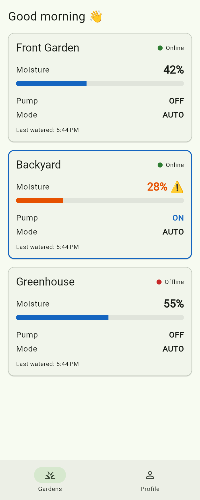
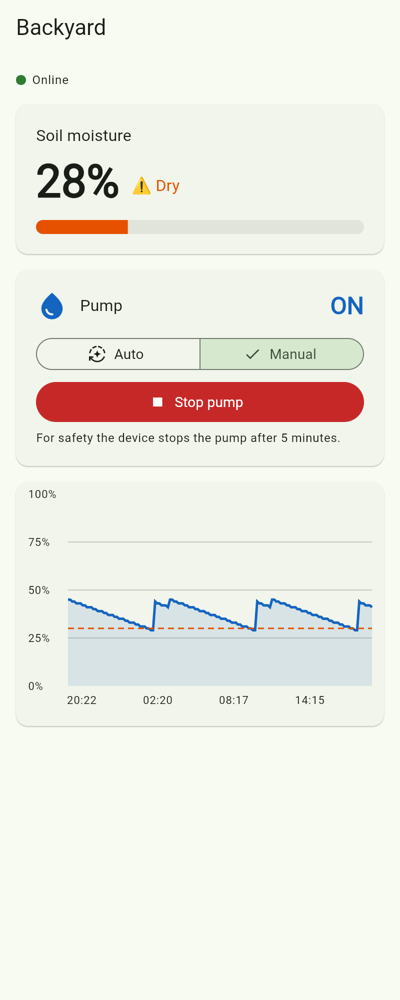

# IRRIGO – Flutter app

Login, a live dashboard of your gardens, and a details page with manual pump
control, threshold setting and a 24-hour moisture chart. Data comes from the
same Firebase Realtime Database the ESP32 writes to (see `../esp32/README.md`).

| Dashboard | Zone details |
|---|---|
|  |  |

## Setup

1. Install Flutter (stable) and the Firebase CLI tools:
   ```sh
   npm install -g firebase-tools
   dart pub global activate flutterfire_cli
   firebase login
   ```
2. In the `app/` folder, connect the app to your Firebase project:
   ```sh
   flutterfire configure
   ```
   Choose the same project as the ESP32. This replaces the placeholder
   `lib/firebase_options.dart` and adds `google-services.json` /
   `GoogleService-Info.plist`.
3. In the Firebase console make sure **Authentication → Email/Password** is enabled and
   the Realtime Database rules from `../firebase/database.rules.json` are published.
4. Run:
   ```sh
   flutter pub get
   flutter run
   ```
5. Register in the app, then put the **same email/password** into the ESP32's
   `secrets.h`. As soon as the ESP32 connects, its garden appears on the dashboard.

## Structure (spec §15)

```
lib/
├── main.dart                  Firebase init + AuthGate (login vs home)
├── firebase_options.dart      generated by `flutterfire configure`
├── models/
│   ├── user.dart              AppUser (name, email)
│   ├── device.dart            Device = one ESP32 with its zones
│   └── irrigation_zone.dart   IrrigationZone + MoisturePoint, online/dry logic
├── services/
│   ├── firebase_service.dart  database paths (match the ESP32 firmware)
│   ├── auth_service.dart      login, register, logout, profile
│   └── device_service.dart    live streams + commands (mode, pump, threshold)
├── screens/
│   ├── auth/                  login_page, register_page
│   ├── home/                  home_page (bottom nav), dashboard_page
│   ├── device/                device_details_page
│   └── profile/               profile_page
├── widgets/                   device_card, moisture_card, pump_card,
│                              moisture_chart, status_indicator
├── theme/app_theme.dart
└── utils/format.dart          "5 min ago", "10:42 AM", greeting
```

## How it talks to the ESP32

- **Reads** (real-time listeners, no polling): `users/<uid>/devices` for the
  dashboard, one zone for the details page, and
  `users/<uid>/moistureHistory/<device>/<zone>` for the chart.
- **Writes** only the app-owned fields: `threshold`, `autoMode`, `pumpCommand`, `name`.
- The pump shows the ESP32's reported `pumpState`. While a manual `pumpCommand`
  hasn't been confirmed yet it shows *Starting…* / *Stopping…*.
- Changing mode always writes `pumpCommand: false` at the same time, so an old
  manual command can never switch the pump on later.
- A device is shown **Offline** when `lastSeen` is older than 30 s.
  `IrrigationZone.hysteresis` (10) must match `HYSTERESIS_PERCENT` in the firmware.

## Tests

```sh
flutter analyze
flutter test
```
